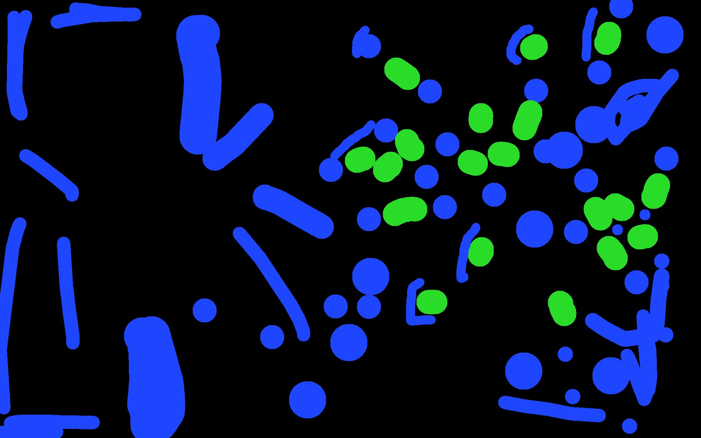
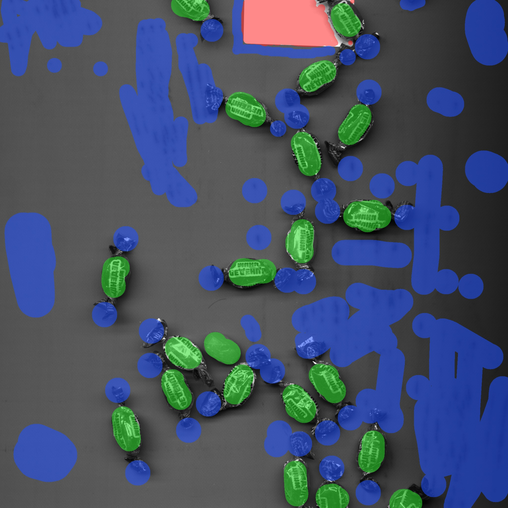
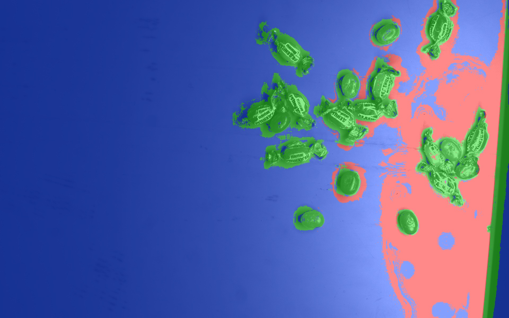
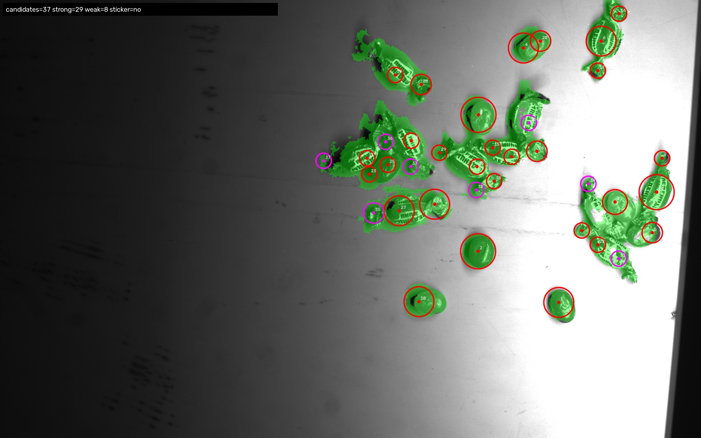
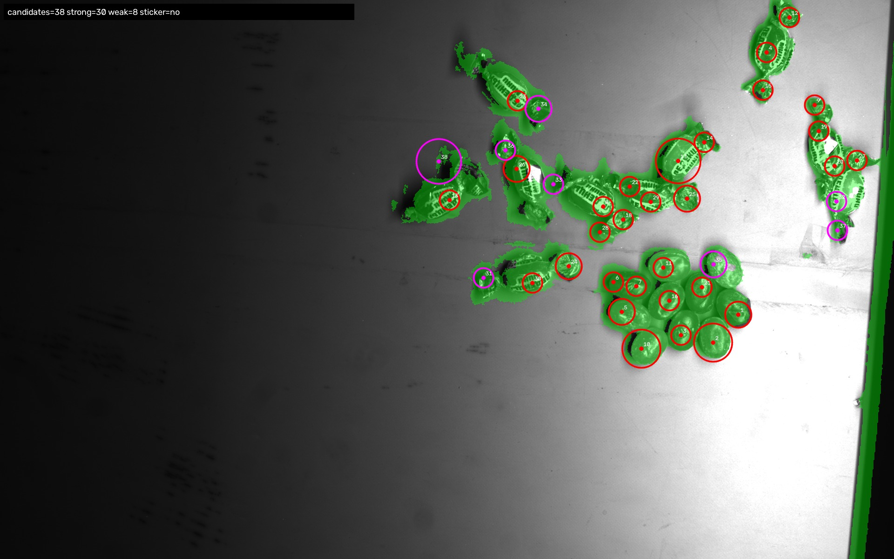
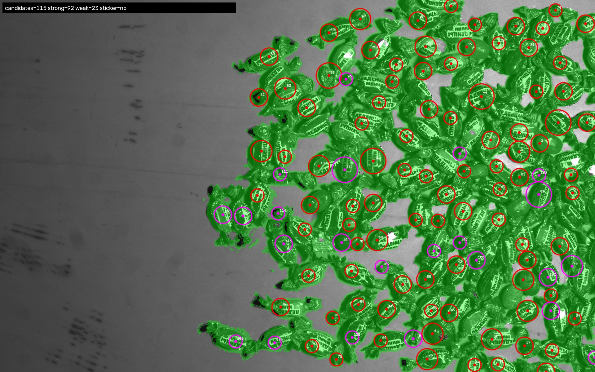
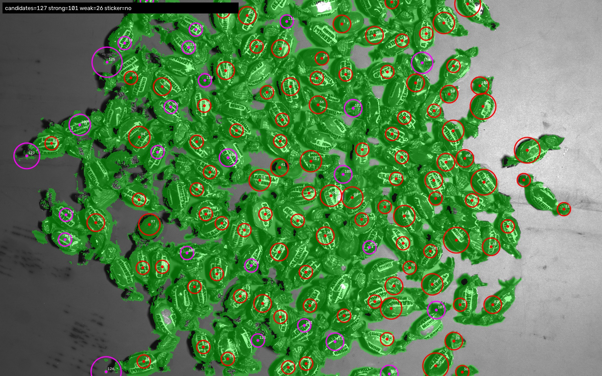

# Candy Quality Control

Рабочий прототип для производственной практики: поиск конфет на изображениях с передней подсветкой, отделение конфет от фона и калибровочного белого стикера, а затем подготовка объектов к подсчёту и классификации на конфеты в обёртке и без обёртки.

Сейчас проект **ещё не является готовой системой контроля качества**. Пиксельная сегментация уже работает достаточно стабильно, белый стикер на тестовой выборке находится корректно, но подсчёт отдельных конфет в плотных кучах пока остаётся главной проблемой.

## Что требуется получить

Для каждого изображения нужно:

1. найти все конфеты, включая частично попавшие в кадр;
2. определить, находится конфета в обёртке или без неё;
3. посчитать:
   - общее количество конфет;
   - количество конфет в обёртке;
   - количество конфет без обёртки;
   - процент брака;
4. не считать белый прямоугольный стикер объектом;
5. не использовать нейронные сети на текущем этапе работы.

Принятая интерпретация классов:

- **wrapped** — конфета в обёртке, не брак;
- **unwrapped** — конфета без обёртки, брак;
- белый стикер — служебный объект, который нужно исключать;
- конфеты на границе изображения тоже должны учитываться.

## Текущее состояние

Сейчас реализован следующий конвейер:

```text
исходное изображение
→ пиксельная классификация background / candy_core / sticker
→ очистка маски
→ геометрическая проверка белого стикера
→ поиск предполагаемых центров конфет
→ визуализация и CSV-отчёты
```

Лучше всего работает пиксельное выделение конфет. На большинстве изображений модель хорошо находит сами конфеты даже при заметно разном освещении.

Основная нерешённая проблема — плотные кучи:

- несколько конфет могут объединяться в одну область;
- одна конфета иногда получает несколько центров;
- отдельные хвосты фантика могут ошибочно считаться самостоятельным объектом;
- часть конфет внутри большой кучи остаётся без собственного центра;
- на некоторых кадрах встречается длинный краевой артефакт от камеры.

Поэтому текущее количество `candidates` пока нельзя считать окончательным количеством конфет.

## Данные

В проекте используются четыре группы изображений:

```text
basler_120126
basler_OldObj
basler_tstRGB
images
```

### Маленькая рабочая выборка

Для быстрых запусков используется:

```text
data/sample/frontlight
```

В ней **23 изображения**:

| Группа          | Количество |
| --------------- | ---------: |
| `basler_120126` |          4 |
| `basler_OldObj` |          7 |
| `basler_tstRGB` |          5 |
| `images`        |          7 |

На этой выборке настраиваются постобработка, стикер и поиск отдельных объектов. Это позволяет не ждать несколько минут после каждого небольшого изменения.

### Полный набор

Полные данные лежат в:

```text
data/raw/frontlight
```

Всего в нём **594 изображения**:

| Группа          | Количество |
| --------------- | ---------: |
| `basler_120126` |         50 |
| `basler_OldObj` |         88 |
| `basler_tstRGB` |          5 |
| `images`        |        451 |

Полный набор используется для выбора обучающих примеров и финальной проверки после настройки алгоритма.

### Ручная разметка

Для обучения вручную размечено **29 изображений** из полного набора.

Размечались три пиксельных класса:

| Значение | Класс        | Что обозначает                                          |
| -------: | ------------ | ------------------------------------------------------- |
|      `1` | `background` | лента, тени, царапины, грязь и другие нецелевые области |
|      `2` | `candy_core` | тело конфеты и видимая часть обёртки                    |
|      `3` | `sticker`    | видимая часть белого калибровочного стикера             |

Разметка хранится в:

```text
annotations/pixel_masks
annotations/metadata
annotations/manifest.csv
annotations/annotation_summary.csv
```

После обучения модель дополнительно проверялась визуально на **40 случайно выбранных изображениях** из `raw`. Эта проверка не является формальной метрикой, но помогла найти проблемы с очень тёмными конфетами и добавить подходящие примеры в обучение.

## Примеры

### Исходное изображение


### Сохранённая пиксельная разметка

Маска ниже создана вручную инструментом разметки. В исходном PNG хранятся не обычные цвета, а номера классов `1`, `2` и `3`. Поэтому при обычном открытии такая маска выглядит почти чёрной: значения `1–3` очень близки к нулю на шкале яркости `0–255`.

Для README маска отдельно раскрашена:

- синий — `background`;
- зелёный — `candy_core`;
- красный — `sticker`.



Ещё один пример — ручная разметка, наложенная на исходный кадр со стикером:



### Предсказание пиксельной модели

Ниже показано цветное наложение результата модели на исходное изображение. Сырая маска в `output/masks` тоже хранит номера классов и без раскрашивания выглядит почти чёрной.



### Текущий результат поиска центров

Красные окружности — уверенные кандидаты, фиолетовые — слабые. Зелёная область показывает маску конфет.







Эти изображения специально оставлены в README не только как удачные примеры. На них хорошо видна текущая проблема с плотными кучами: часть центров пропускается, а часть хвостов и небольших фрагментов получает лишние кандидаты.

## Как развивалось решение

### 1. Классическая обработка OpenCV

Сначала использовались только алгоритмические методы:

- пороговая обработка;
- локальный контраст;
- морфологические операции;
- связные компоненты;
- контуры и геометрические фильтры;
- фильтрация по площади и форме.

На отдельных кадрах результат выглядел нормально, но единые пороги плохо переносились между группами изображений. Освещение сильно меняется, на ленте есть царапины и грязь, конфеты часто соприкасаются и перекрываются.

Поэтому чисто алгоритмический вариант давал одновременно пропуски конфет и большое количество ложных объектов.

### 2. Обучение по ручным мазкам

После этого был сделан собственный инструмент пиксельной разметки. На изображениях вручную отмечались фон, конфеты и стикер.

На размеченных пикселях обучается `RandomForestClassifier` из scikit-learn:

- 240 деревьев;
- 20 признаков на пиксель;
- три класса;
- признаки цвета в текущей финальной версии отключены;
- после оценки модель дополнительно обучается на всех доступных 29 размеченных изображениях.

Модель и вспомогательные файлы:

```text
models/pixel_segmenter.joblib
models/pixel_segmenter_info.json
models/pixel_training_dataset.npz
```

### 3. Постобработка

После пиксельной модели выполняются:

- удаление мелкого шума;
- сохранение слабых и пограничных конфет;
- отдельная обработка длинных артефактов у края кадра;
- проверка стикера по яркости, форме и прямоугольности;
- восстановление стикера, частично закрытого конфетами;
- построение центров объектов;
- создание масок, изображений и CSV-отчётов.

Для разделения соприкасающихся конфет пробовались:

- distance transform;
- локальные максимумы;
- marker-controlled watershed;
- адаптивное подавление соседних максимумов;
- резервные маркеры в областях без центра;
- Fast Radial Symmetry Transform.

FRST дал более понятные центры, чем обычный watershed, но полностью проблему плотных куч не решил.

## Метрики пиксельной модели

Финальные значения, полученные на holdout-проверке перед окончательным обучением модели на всех размеченных изображениях:

| Метрика                                | Значение |
| -------------------------------------- | -------: |
| Holdout accuracy                       | `0.8566` |
| Macro precision по трём классам        | `0.8627` |
| Macro recall по трём классам           | `0.8567` |
| Macro F1 по трём классам               | `0.8564` |
| Weighted F1                            | `0.8555` |
| Macro F1 для `background + candy_core` | `0.8369` |
| OOB score оценочной модели             | `0.9303` |
| OOB score финальной модели             | `0.9233` |
| Precision для `background`             | `0.8485` |
| Recall для `background`                | `0.7585` |
| F1 для `background`                    | `0.8009` |
| Precision для `candy_core`             | `0.8070` |
| Recall для `candy_core`                | `0.9505` |
| F1 для `candy_core`                    | `0.8729` |
| Precision для `sticker`                | `0.9328` |
| Recall для `sticker`                   | `0.8610` |
| F1 для `sticker`                       | `0.8954` |

### Что означают эти числа

**Accuracy** — доля всех пикселей, которым модель назначила правильный класс. Для сегментации одной accuracy недостаточно: фона обычно намного больше, чем целевых объектов, поэтому хороший результат по фону способен скрыть ошибки на конфетах.

**Precision** показывает, какая доля пикселей, объявленных моделью конфетой или стикером, действительно относится к этому классу.

Например, precision `candy_core = 0.8070` означает, что примерно 80,7% пикселей, которые модель назвала конфетой, совпали с ручной разметкой. Остальные пиксели чаще всего относятся к теням, хвостам фантика или участкам фона рядом с объектами.

**Recall** показывает, какую долю настоящих пикселей класса модель смогла найти.

Recall `candy_core = 0.9505` означает, что модель на проверочной части нашла примерно 95,1% размеченных пикселей конфет. Высокий recall здесь важен: лучше сохранить немного лишней области, чем полностью потерять конфету.

**F1** объединяет precision и recall в одно число. Высокий F1 означает, что модель одновременно не слишком много пропускает и не создаёт слишком много ложных пикселей.

**Macro F1** — среднее F1 по всем классам с одинаковым весом. Поэтому большой класс фона не может полностью задавить ошибки на менее многочисленных классах.

**Weighted F1** тоже усредняет F1 по классам, но учитывает количество пикселей каждого класса. Его значение близко к Macro F1, поэтому итоговая оценка не держится только на одном большом классе фона.

**OOB score** — внутренняя проверка Random Forest на объектах, которые не попали в bootstrap-выборку конкретного дерева. Значение `0.9303` относится к оценочной модели, использованной перед финальным переобучением. Значение `0.9233` относится к окончательной модели, которая затем была обучена на всех доступных размеченных изображениях.

Важно: это **пиксельные метрики**. Они показывают качество выделения областей, но не доказывают правильность подсчёта отдельных конфет. В плотной куче модель может правильно окрасить почти все пиксели конфет, но не суметь разделить их на отдельные экземпляры.

Подробные отчёты хранятся в:

```text
output/reports
models/backup/stage3_1_final_29
```

## Белый стикер

Стикер встречается только в группе `images`, но присутствует не на каждом изображении этой группы.

Текущий алгоритм использует:

- пиксельный класс `sticker`;
- яркость исходного изображения;
- отношение сторон;
- прямоугольность;
- площадь;
- объединение частей, разделённых лежащими сверху конфетами.

На рабочей выборке `sample` корректно находятся все **7 из 7** известных стикеров. Ложное срабатывание в `basler_OldObj`, которое было в ранней версии, устранено запретом искать стикер вне группы `images`.

## Структура проекта

```text
candy_quality_control/
├── annotations/          # ручная пиксельная разметка и метаданные
├── configs/              # параметры этапов
├── data/
│   ├── raw/frontlight/   # полный набор, 594 изображения
│   └── sample/frontlight/# быстрая рабочая выборка, 23 изображения
├── models/               # обученная пиксельная модель и резервные версии
├── output/
│   ├── annotated/        # основные изображения для визуальной проверки
│   ├── masks/            # сырые маски пиксельной модели
│   ├── cleaned_masks/    # очищенные маски
│   ├── marker_masks/     # технические одноточечные маркеры
│   ├── marker_previews/  # увеличенные маркеры для просмотра
│   ├── sticker_masks/    # подтверждённые области стикера
│   ├── distance_maps/    # отладочные карты
│   ├── instance_labels/  # предварительные метки объектов
│   └── reports/          # CSV, JSON и текстовые отчёты
├── src/                  # исходный код
├── tests/                # smoke-тесты
├── requirements.txt
├── run_stage1.sh
├── run_stage2.sh
├── run_stage3.sh
└── run_stage4.sh
```

## Основные файлы

| Файл                             | Назначение                            |
| -------------------------------- | ------------------------------------- |
| `src/audit_dataset.py`           | аудит наборов изображений             |
| `src/annotate.py`                | ручная пиксельная разметка            |
| `src/prepare_annotation_set.py`  | подготовка набора для разметки        |
| `src/validate_annotations.py`    | проверка полноты разметки             |
| `src/pixel_features.py`          | вычисление признаков пикселей         |
| `src/train_pixel_segmenter.py`   | обучение Random Forest                |
| `src/predict_pixel_segmenter.py` | получение пиксельных масок            |
| `src/postprocess_candidates.py`  | очистка масок и поиск кандидатов      |
| `src/radial_symmetry.py`         | поиск центров по радиальной симметрии |
| `src/check_stage4.py`            | проверка выходных файлов этапа 4      |

## Установка

Проект разрабатывается на Linux с Python 3.11.

```bash
python3 -m venv venv
source venv/bin/activate
python3 -m pip install -r requirements.txt
```

Основные библиотеки:

- OpenCV;
- NumPy;
- SciPy;
- scikit-image;
- scikit-learn;
- pandas;
- matplotlib;
- Pillow;
- PyYAML;
- joblib;
- tqdm.

## Запуск

### Проверка окружения и данных

```bash
./run_stage1.sh
```

### Работа с разметкой

Проверить все сохранённые разметки:

```bash
./run_stage2.sh validate raw --require-all
```

Проверка и редактирование разметки выполняются командами `run_stage2.sh`.

### Обучение пиксельной модели

```bash
./run_stage3.sh train raw
./run_stage3.sh check
```

Для быстрого визуального прогона по 23 изображениям:

```bash
./run_stage3.sh predict sample
```

### Постобработка и центры

```bash
./run_stage4.sh process sample --debug
./run_stage4.sh check
```

Главные результаты после запуска:

```text
output/annotated
output/reports/stage4_images.csv
output/reports/stage4_candidates.csv
output/reports/stage4_summary.txt
```

## Что уже можно считать рабочим

- чтение и аудит всех наборов данных;
- ручная пиксельная разметка;
- проверка разметки;
- обучение и сохранение модели;
- пиксельное выделение большинства конфет;
- работа с разным освещением;
- обнаружение белого стикера;
- сохранение конфет на границе изображения;
- отчёты и воспроизводимые команды запуска;
- быстрый цикл настройки на 23 изображениях;
- дополнительная визуальная проверка на случайной выборке из 40 изображений.

## Что пока не работает достаточно хорошо

- точный подсчёт конфет в плотных кучах;
- гарантированно один центр на одну конфету;
- отделение центрального тела от хвостов фантика;
- уверенное разделение сильно перекрывающихся объектов;
- окончательная классификация `wrapped / unwrapped`;
- расчёт итогового процента брака по всему набору.

## Возможные причины ошибок и варианты доработки

Основная проблема возникает не на этапе выделения конфет, а при разделении плотной кучи на отдельные объекты.

### Причины ошибок

- соседние конфеты соединяются хвостами фантиков, тенями и бликами;
- на одной конфете может появляться несколько центров;
- хвосты обёртки иногда принимаются за отдельные конфеты;
- внутри плотных куч часть объектов остаётся без центра;
- тёмные и пересвеченные кадры требуют разных параметров;
- вертикальная полоса у края изображения создаёт ложные кандидаты;
- хорошие пиксельные метрики не гарантируют правильный подсчёт объектов.

### Возможные улучшения

1. Морфологически удалять тонкие хвосты и соединения перед поиском центров.
2. Объединять кандидаты от distance transform, радиальной симметрии и анализа контуров.
3. Удалять близкие дубли с учётом предполагаемого размера конфеты.
4. Отдельно обрабатывать крупные компоненты, соответствующие плотным кучам.
5. Фильтровать длинные узкие компоненты, соприкасающиеся с краем кадра.
6. Разметить вручную центры конфет на небольшой выборке и использовать объектные метрики.
7. Обучить классификатор, отличающий центр конфеты от хвоста фантика и шума.
8. Классификацию `wrapped / unwrapped` выполнять отдельно после обнаружения объектов.

Наиболее перспективный вариант — сохранить текущую пиксельную модель, добавить ручную разметку центров и обучить отдельный классификатор кандидатов.
