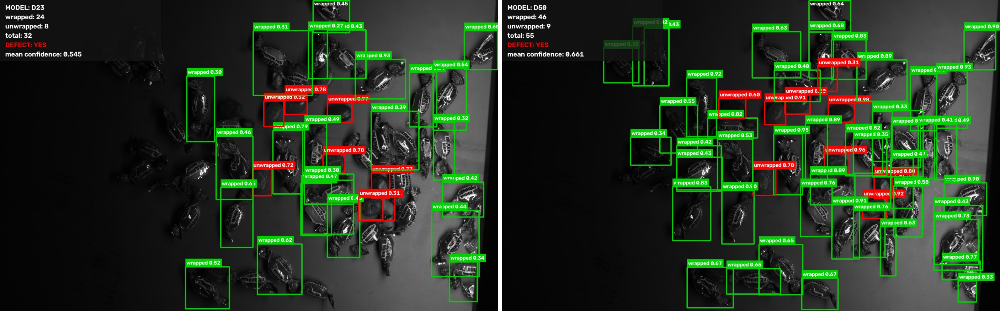
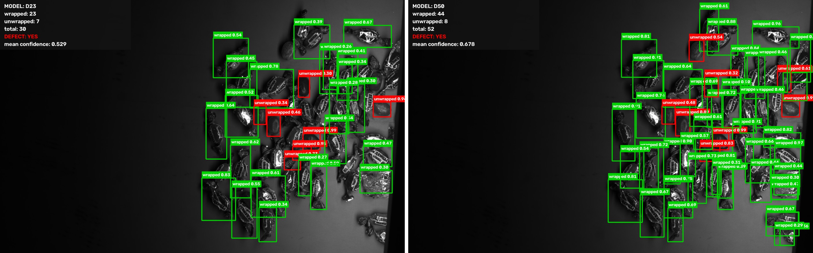
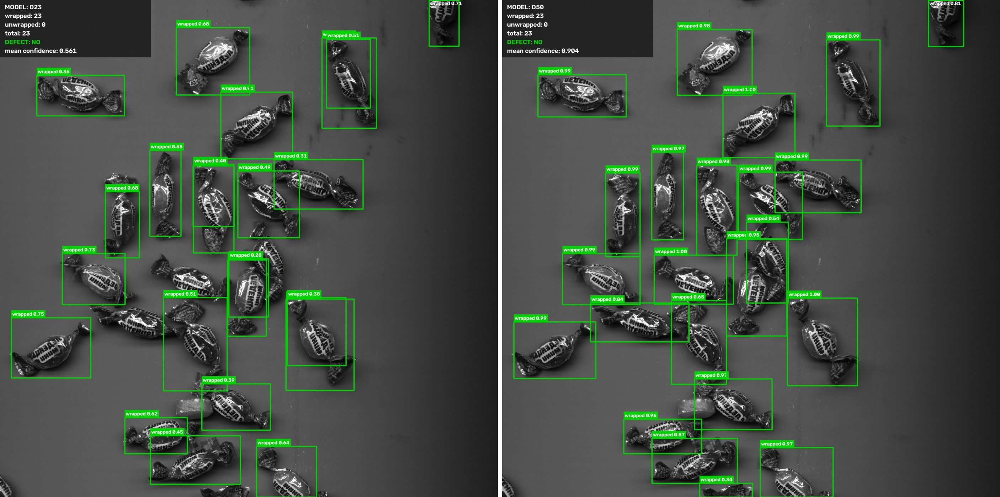
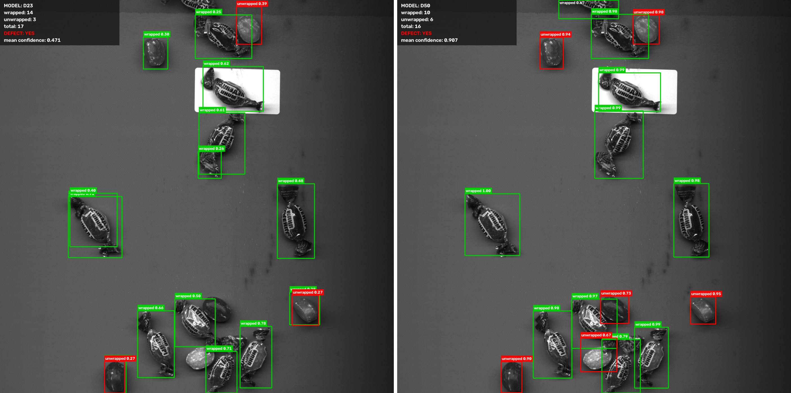
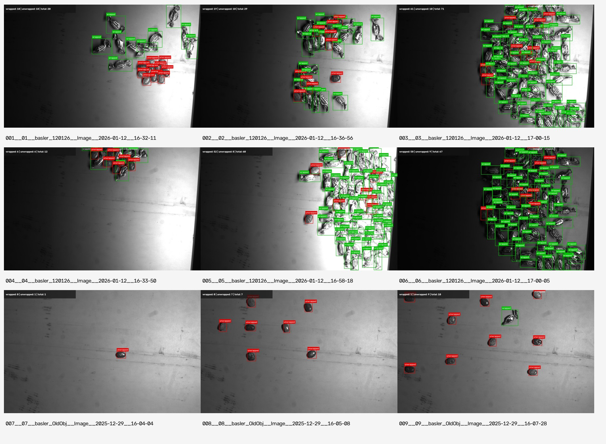
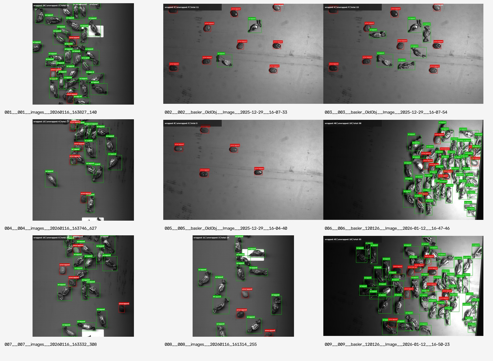
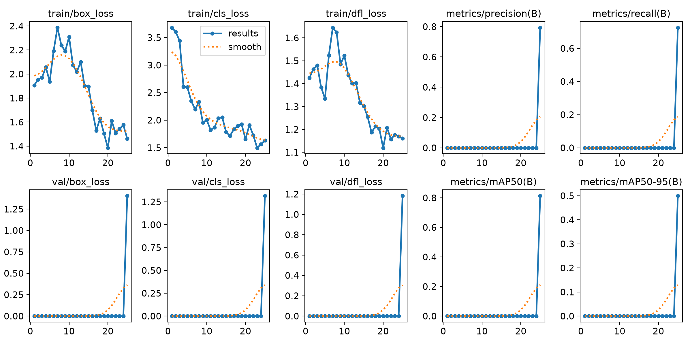
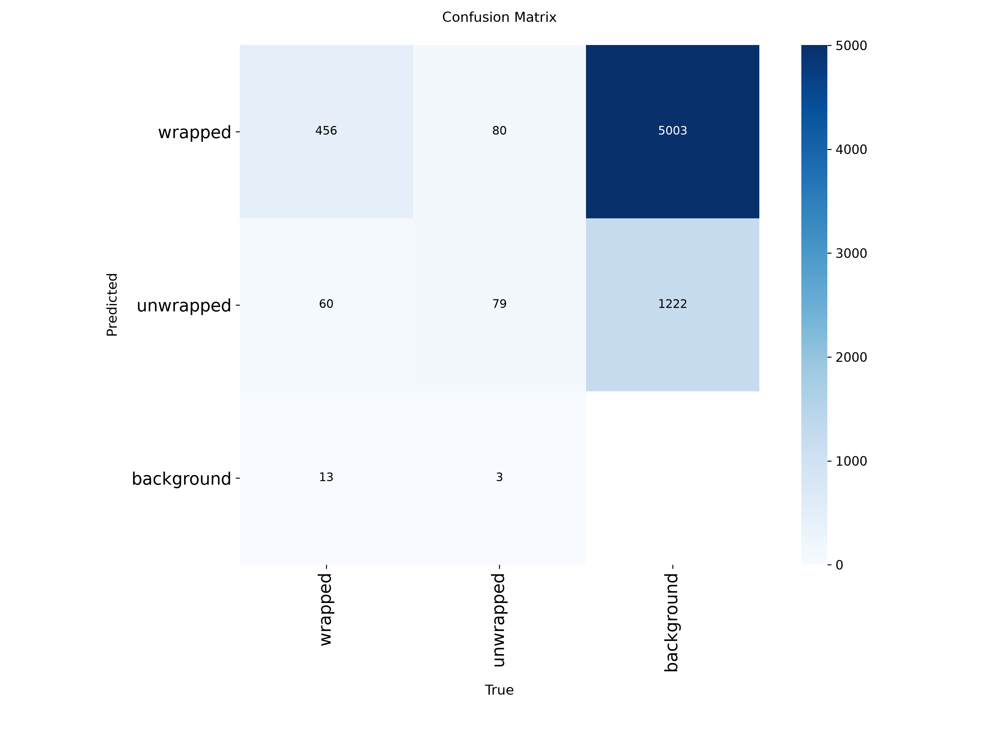
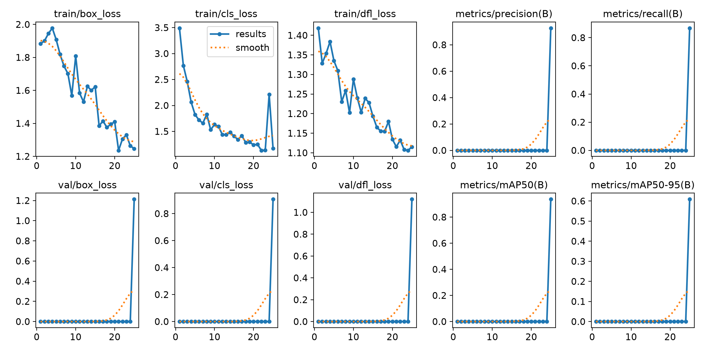
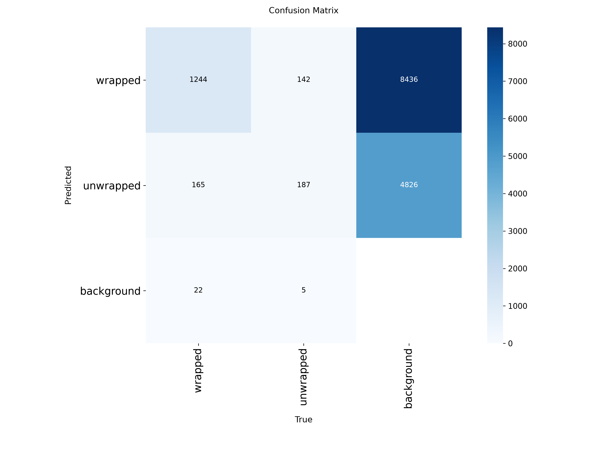

# Candy Quality Control — YOLOv8

Система контроля качества конфет на изображениях с передней подсветкой. Программа находит отдельные конфеты, классифицирует их на конфеты в обёртке и без обёртки, считает объекты каждого класса и вычисляет процент брака.

## Итог работы

В финальной версии используются два класса:

- `wrapped` — конфета в обёртке, небракованный объект;
- `unwrapped` — конфета без обёртки, брак.

Белый прямоугольный стикер считается калибровочным объектом и не размечается как конфета. Конфеты, частично попавшие в кадр, учитываются, когда по видимой части можно уверенно определить объект и его класс.

Для сравнения я обучил две модели YOLOv8n:

| Модель | Обучающие изображения | Размеченные объекты |
| ------ | --------------------: | ------------------: |
| `D23`  |                    23 |                 691 |
| `D50`  |                    50 |                1765 |

В `D23` было 529 объектов `wrapped` и 162 объекта `unwrapped`. В `D50` — 1431 объект `wrapped` и 334 объекта `unwrapped`. В обоих наборах присутствовал один отрицательный кадр со стикером и без конфет.

Обе модели обучались независимо от исходных весов `yolov8n.pt` в течение 25 эпох с одинаковыми параметрами. После обучения я проверил их на одной и той же независимой выборке из 119 изображений, которые не использовались при обучении.

### Главная метрика обнаружения брака

Для объективной проверки я вручную поставил точки в центрах всех реальных конфет без обёртки на 119 отложенных изображениях. Всего в тестовой выборке было 396 бракованных конфет.

| Метрика                               |  `D23` |      `D50` |
| ------------------------------------- | -----: | ---------: |
| Найдено бракованных конфет, TP        |    261 |    **364** |
| Пропущено бракованных конфет, FN      |    135 |     **32** |
| Ложных определений брака, FP          |     67 |     **10** |
| Recall брака                          | 65,91% | **91,92%** |
| Precision брака                       | 79,57% | **97,33%** |
| F1 брака                              | 72,10% | **94,55%** |
| Accuracy наличия брака на изображении | 82,35% | **98,32%** |

Финальной выбрана модель `D50`, потому что она существенно реже пропускает конфеты без обёртки и одновременно даёт меньше ложных срабатываний.

### Итоговый прогон `D50` на 119 изображениях

При пороге уверенности `0.25` программа обнаружила:

| Показатель                        | Значение |
| --------------------------------- | -------: |
| Обработано изображений            |      119 |
| Всего найдено объектов            |     2430 |
| Небракованные, `wrapped`          |     2056 |
| Бракованные, `unwrapped`          |      374 |
| Доля найденного брака             |   15,39% |
| Изображений с обнаруженным браком |      111 |

Процент брака для каждого изображения вычисляется по формуле:

```text
unwrapped / (wrapped + unwrapped) * 100%
```

## Наглядное сравнение `D23` и `D50`

На сравнительных изображениях слева показана модель `D23`, справа — `D50`.

- зелёная рамка — `wrapped`;
- красная рамка — `unwrapped`;
- в информационном блоке указано количество объектов каждого класса;
- подпись рамки содержит класс и уверенность модели.

### Сложное тёмное изображение



### Плотная куча



### Кадр с большим количеством объектов



### Смешанный кадр с двумя классами



Все 119 результатов обеих моделей находятся в каталогах:

```text
yolo/evaluation/holdout119_d23_vs_d50/d23/
yolo/evaluation/holdout119_d23_vs_d50/d50/
```

## Примеры ручной разметки

Разметка выполнялась в CVAT прямоугольниками без поворота. Для каждого уверенно различимого объекта создавалась отдельная рамка.

### Первые 23 изображения



Все размеченные изображения:

```text
docs/images/annotations/d23/
```

### Полный набор из 50 изображений



Все размеченные изображения:

```text
docs/images/annotations/d50/
```

Цвета на изображениях разметки:

- зелёная рамка — `wrapped`;
- красная рамка — `unwrapped`.

## Результаты обучения

### `D23`





### `D50`





Графики, матрицы ошибок, параметры и CSV обучения находятся в:

```text
yolo/release/training/d23_e25/
yolo/release/training/d50_e25/
```

Важно: внутренние графики Ultralytics строились на данных, указанных в `val` конфигурации. В этом срочном эксперименте `val` совпадал с обучающим набором, поэтому эти графики показывают процесс усвоения обучающих данных и не используются как итоговая независимая оценка. Итоговые значения recall, precision и F1 получены отдельно на 119 отложенных изображениях с ручной точечной разметкой брака.

# Постановка задачи

Для каждого изображения требуется:

1. найти объекты, похожие на конфеты;
2. разделить найденные объекты на два класса:
   - конфеты в обёртке;
   - конфеты без обёртки;
3. посчитать:
   - общее количество объектов;
   - количество бракованных объектов;
   - количество небракованных объектов;
4. вычислить процент бракованных конфет;
5. визуализировать результат рамками и подписями;
6. сохранить итоговые данные в текстовые и CSV-отчёты.

Финальный конвейер:

```text
исходное изображение
→ YOLOv8n
→ координаты рамок, класс и confidence
→ подавление пересекающихся детекций
→ подсчёт wrapped и unwrapped
→ вычисление процента брака
→ изображение с рамками
→ CSV и TXT-отчёты
```

# Как развивалась работа

## 1. Анализ исходной задачи

Сначала я изучил все выданные данные и уточнил требования:

- используется передняя подсветка;
- конфета без обёртки считается браком;
- конфета в обёртке считается небракованной;
- белый прямоугольный стикер является калибровочным и не должен считаться объектом;
- конфеты на границе кадра нужно учитывать;
- пустые обёртки в текущем наборе отдельно не рассматриваются.

Полный набор содержит 594 изображения из четырёх групп:

| Группа          | Изображений |
| --------------- | ----------: |
| `basler_120126` |          50 |
| `basler_OldObj` |          88 |
| `basler_tstRGB` |           5 |
| `images`        |         451 |
| **Всего**       |     **594** |

## 2. Первый алгоритмический вариант

Первую рабочую версию я сделал без нейронной сети, используя OpenCV и классические методы обработки изображений:

- пороговую обработку;
- локальный контраст;
- морфологические операции;
- контуры и связные компоненты;
- геометрические фильтры;
- поиск центров;
- watershed;
- радиальную симметрию;
- отдельное исключение белого стикера.

Этот вариант сохранён в ветке:

```text
practice/current-prototype
```

Алгоритм мог выделять конфеты на части изображений, но единые пороги плохо переносились между разными условиями освещения. Основной проблемой стали плотные кучи: несколько конфет объединялись в одну область, хвосты обёртки иногда считались отдельными объектами, а часть конфет внутри куч пропускалась.

## 3. Переход к YOLOv8

После обсуждения с руководителем я перешёл к объектной детекции YOLOv8. В качестве базовой модели выбрана `YOLOv8n`, потому что она сравнительно небольшая и может обучаться на моём ноутбуке без GPU.

Проверка окружения выполняется скриптом:

```text
yolo/scripts/check_environment.py
```

Исходные веса:

```text
yolo/weights/yolov8n.pt
```

## 4. Аудит полного датасета

Перед разметкой я автоматически проанализировал все 594 изображения:

- проверил читаемость;
- построил индекс файлов;
- проверил точные дубликаты;
- нашёл визуально близкие кадры;
- создал таблицы для ручного просмотра;
- подготовил контактные листы.

Скрипт:

```text
yolo/scripts/audit_dataset.py
```

Текстовые результаты:

```text
yolo/audit/summary.md
yolo/audit/summary.json
yolo/audit/dataset_index.csv
yolo/audit/exact_duplicates.csv
yolo/audit/near_duplicates.csv
yolo/audit/review_manifest.csv
```

## 5. Правила разметки

Я зафиксировал правила разметки до начала массовой работы:

- одна различимая конфета — одна рамка;
- используются только осевые прямоугольники, без поворота;
- скрытые части объекта не додумываются;
- пересечение рамок допустимо;
- рамку нельзя уменьшать только ради исключения пересечения;
- видимые части обёртки входят в рамку `wrapped`;
- стикер не размечается;
- маленький неразличимый фрагмент обёртки игнорируется;
- пограничная конфета размечается по видимой части;
- неоднозначные случаи фиксируются отдельно.

Документы:

```text
yolo/annotation/annotation_rules.md
yolo/annotation/annotation_checklist.md
yolo/annotation/annotation_decisions.csv
yolo/annotation/rules_review_manifest.csv
```

## 6. Пилотная выборка из 23 изображений

Первые 23 изображения я выбрал вручную. В выборку специально вошли:

- одиночные конфеты;
- плотные кучи;
- перекрывающиеся объекты;
- объекты у границы кадра;
- тёмные и пересвеченные изображения;
- кадры со стикером;
- примеры обоих классов;
- один отрицательный кадр только со стикером.

Разметка выполнялась в CVAT. После первых тестов я отдельно проверил корректность экспорта YOLO, порядок классов и нормализованные координаты.

Итог пилотной выборки:

```text
23 изображения
691 рамка
529 wrapped
162 unwrapped
```

Проверка:

```text
yolo/scripts/check_pilot23_complete.py
```

Экспорт CVAT:

```text
yolo/release/annotations/candy_pilot_23_complete_v1.zip
```

## 7. План инкрементального расширения

Изначально я планировал получить наборы из 50, 75, 100 и 125 изображений и сравнить изменение качества. Отдельно случайным образом были выбраны 119 изображений, которые не пересекаются с обучающими данными.

Скрипт планирования:

```text
yolo/scripts/plan_incremental_selection.py
```

Результаты:

```text
yolo/selection/incremental_v1/manifests/
yolo/selection/incremental_v1/contact_sheets/
yolo/selection/incremental_v1/selection_summary.txt
```

Распределение 119 holdout-изображений:

| Группа          | Изображений |
| --------------- | ----------: |
| `basler_120126` |           9 |
| `basler_OldObj` |          17 |
| `images`        |          93 |
| **Всего**       |     **119** |

Группа `basler_tstRGB` целиком вошла в первые 23 изображения и поэтому не попала в независимый holdout.

## 8. Расширение до 50 изображений

Следующие 27 изображений были выбраны случайно из доступных групп, не пересекаясь с holdout. После полной разметки общий набор составил:

```text
50 изображений
1765 рамок
1431 wrapped
334 unwrapped
```

Экспорт новых 27 изображений:

```text
yolo/release/annotations/candy_train_to_50_complete_v1.zip
```

Из-за ограниченного времени я остановился на 50 изображениях и перешёл к обучению, чтобы успеть получить, проверить и оформить работающую систему.

## 9. Обучение `D23` и `D50`

Скрипт подготовки наборов:

```text
yolo/scripts/prepare_d23_d50.py
```

Скрипт обучения:

```text
yolo/scripts/train_d23_d50.py
```

Обе модели:

- стартуют независимо от `yolov8n.pt`;
- обучаются 25 эпох;
- используют размер входа `640`;
- используют `batch=2`;
- работают на CPU;
- используют `seed=42`;
- сравниваются при одинаковых параметрах.

Веса, сохранённые для воспроизведения:

```text
yolo/release/models/d23_e25_last.pt
yolo/release/models/d50_e25_last.pt
```

## 10. Визуальное сравнение на 119 изображениях

После обучения обе модели были запущены на одинаковой holdout-выборке:

```text
yolo/scripts/compare_d23_d50_holdout.py
```

Скрипт сохраняет:

- отдельные изображения `D23`;
- отдельные изображения `D50`;
- количество объектов каждого класса;
- confidence;
- признак наличия брака;
- CSV по всем изображениям.

Результаты:

```text
yolo/evaluation/holdout119_d23_vs_d50/d23/
yolo/evaluation/holdout119_d23_vs_d50/d50/
yolo/evaluation/holdout119_d23_vs_d50/predictions.csv
yolo/evaluation/holdout119_d23_vs_d50/summary.txt
```

Визуально `D50` заметно лучше обрабатывает плотные кучи, тёмные кадры и небольшие объекты.

## 11. Объективная проверка брака

Визуального сравнения было недостаточно, потому что основная метрика должна показывать долю найденных конкретных бракованных конфет, а не только долю правильно обработанных изображений.

Поэтому для всех 119 тестовых изображений я создал точечную разметку:

```text
одна реальная unwrapped-конфета = одна точка
```

Нормальные конфеты точками не отмечались. Такой способ позволяет точно посчитать TP и FN для брака, не выполняя повторно полную рамочную разметку всех конфет.

Подготовка задачи CVAT:

```text
yolo/scripts/prepare_holdout119_points_task.py
```

Экспорт точечной разметки:

```text
yolo/release/annotations/holdout119_unwrapped_gt_v1.zip
```

Расчёт метрик:

```text
yolo/scripts/evaluate_unwrapped_points.py
```

Результаты:

```text
yolo/evaluation/holdout119_point_metrics/summary.txt
yolo/evaluation/holdout119_point_metrics/per_image_metrics.csv
```

## 12. Финальная программа

Финальный скрипт:

```text
yolo/scripts/run_final_detector.py
```

Он выполняет основную задачу целиком:

- находит конфеты;
- определяет `wrapped` или `unwrapped`;
- рисует цветные рамки;
- подписывает класс и confidence;
- считает общее количество;
- считает количество нормальных конфет;
- считает количество бракованных конфет;
- вычисляет процент брака;
- сохраняет сводку по изображениям;
- сохраняет отдельную строку для каждой детекции.

Результаты финального прогона:

```text
yolo/final_output/best_model_holdout119/summary.txt
yolo/final_output/best_model_holdout119/images_summary.csv
yolo/final_output/best_model_holdout119/detections.csv
```

# Структура YOLO-части проекта

```text
СТРУКТУРА YOLO-ЧАСТИ ПРОЕКТА

yolo/
│
├── annotation/                         — правила и контроль ручной разметки
│   ├── annotation_rules.md             — правила построения рамок
│   ├── annotation_checklist.md         — проверка качества разметки
│   ├── annotation_decisions.csv        — принятые решения по спорным объектам
│   └── classes.txt                     — классы wrapped и unwrapped
│
├── audit/                              — аудит исходного набора изображений
│   ├── summary.md                      — текстовая сводка
│   ├── summary.json                    — результаты аудита
│   └── dataset_index.csv               — индекс исходных изображений
│
├── datasets/                           — обучающие наборы данных
│   └── learning_curve/
│       ├── d23/                        — пилотная выборка из 23 изображений
│       └── d50/                        — расширенная выборка из 50 изображений
│
├── evaluation/                         — проверка качества моделей
│   ├── holdout119_d23_vs_d50/          — сравнение D23 и D50
│   └── holdout119_point_metrics/       — расчёт TP, FP, FN и метрик
│
├── final_output/                       — результаты итоговой программы
│   └── best_model_holdout119/
│       ├── annotated/                  — изображения с рамками
│       ├── summary.txt                 — общая сводка
│       ├── images_summary.csv          — результаты по изображениям
│       └── detections.csv              — сведения об отдельных объектах
│
├── release/                            — сохранённые результаты экспериментов
│   ├── annotations/                    — экспортированные аннотации
│   ├── models/                         — веса моделей D23 и D50
│   └── training/                       — параметры и журналы обучения
│
├── scripts/                            — основные программные модули
│   ├── train_d23_d50.py                — обучение моделей
│   ├── compare_d23_d50_holdout.py      — визуальное сравнение моделей
│   ├── evaluate_unwrapped_points.py    — расчёт количественных метрик
│   └── run_final_detector.py           — итоговая программа
│
├── selection/                          — формирование расширенной выборки
│   └── incremental_v1/
│
└── weights/
    └── yolov8n.pt                      — исходные предобученные веса
```

# Установка

Проект проверялся на Linux с Python 3.11.

```bash
git clone https://github.com/gioshek/Summer_Practic_2026.git
cd Summer_Practic_2026
git checkout feature/yolov8
```

Создание окружения:

```bash
python3.11 -m venv venv_yolo
source venv_yolo/bin/activate
python -m pip install --upgrade pip
python -m pip install -r requirements.txt
```

Проверка окружения:

```bash
python yolo/scripts/check_environment.py
```

В текущей версии обучение и предсказание настроены на CPU.

# Данные

Полный сырой датасет не загружается в Git из-за размера. Локально он должен иметь структуру:

```text
data/raw/frontlight/
├── basler_120126/
├── basler_OldObj/
├── basler_tstRGB/
└── images/
```

В репозитории остаётся маленькая демонстрационная выборка:

```text
data/sample/frontlight/
```

Файлы из `data/sample/frontlight` и веса `.pt` хранятся через Git LFS.

# Как воспроизвести этапы

Все команды выполняются из корня репозитория:

```bash
cd ~/SummerPractic2026/candy_quality_control
source venv_yolo/bin/activate
```

## 1. Проверить окружение

```bash
python yolo/scripts/check_environment.py
```

## 2. Повторить аудит полного датасета

```bash
python yolo/scripts/audit_dataset.py
```

Результаты появятся в:

```text
yolo/audit/
```

## 3. Проверить первые аннотации

```bash
python yolo/scripts/check_first_annotations.py
python yolo/scripts/check_pilot23_complete.py
```

## 4. Повторить планирование выборок

```bash
python yolo/scripts/plan_incremental_selection.py \
    --seed 42 \
    --holdout-size 119
```

## 5. Собрать `D23` и `D50`

Для этой команды локально нужны:

- исходные BMP в `data/raw/frontlight`;
- экспорты CVAT из `yolo/release/annotations`.

Экспорты из `yolo/release/annotations` нужно скопировать в ожидаемые скриптом пути:

```bash
mkdir -p yolo/annotation/cvat_exports

cp yolo/release/annotations/candy_pilot_23_complete_v1.zip \
   yolo/annotation/cvat_exports/

cp yolo/release/annotations/candy_train_to_50_complete_v1.zip \
   yolo/annotation/cvat_exports/

python yolo/scripts/prepare_d23_d50.py
```

Готовые наборы:

```text
yolo/datasets/learning_curve/d23/
yolo/datasets/learning_curve/d50/
```

Изображения наборов генерируются локально и не хранятся в Git. YOLO-метки и манифесты находятся в репозитории.

## 6. Повторить обучение

```bash
python yolo/scripts/train_d23_d50.py \
    --only both \
    --epochs 25 \
    --imgsz 640 \
    --batch 2 \
    --threads 2
```

Исходные результаты появятся в:

```text
yolo/runs/learning_curve/d23_e25/
yolo/runs/learning_curve/d50_e25/
```

Для обычного запуска повторное обучение не требуется: готовые веса лежат в `yolo/release/models`.

## 7. Повторить визуальное сравнение на holdout

При использовании готовых весов можно создать ожидаемую структуру:

```bash
mkdir -p yolo/runs/learning_curve/d23_e25/weights
mkdir -p yolo/runs/learning_curve/d50_e25/weights

cp yolo/release/models/d23_e25_last.pt \
   yolo/runs/learning_curve/d23_e25/weights/last.pt

cp yolo/release/models/d50_e25_last.pt \
   yolo/runs/learning_curve/d50_e25/weights/last.pt
```

Запуск:

```bash
python yolo/scripts/compare_d23_d50_holdout.py \
    --imgsz 640 \
    --conf 0.25 \
    --iou 0.70 \
    --threads 2
```

## 8. Повторить проверку качества брака

Скопировать ground truth:

```bash
mkdir -p yolo/annotation/cvat_exports

cp yolo/release/annotations/holdout119_unwrapped_gt_v1.zip \
   yolo/annotation/cvat_exports/
```

Запустить:

```bash
python yolo/scripts/evaluate_unwrapped_points.py \
    --cvat-export \
    yolo/annotation/cvat_exports/holdout119_unwrapped_gt_v1.zip \
    --mapping \
    yolo/annotation/holdout119_points_upload/holdout_mapping.csv \
    --raw-root \
    data/raw/frontlight \
    --model-d23 \
    yolo/release/models/d23_e25_last.pt \
    --model-d50 \
    yolo/release/models/d50_e25_last.pt \
    --output \
    yolo/evaluation/holdout119_point_metrics \
    --imgsz 640 \
    --conf 0.25 \
    --iou 0.70 \
    --threads 2
```

Посмотреть итог:

```bash
cat yolo/evaluation/holdout119_point_metrics/summary.txt
```

## 9. Запустить финальную программу на 119 изображениях

```bash
python yolo/scripts/run_final_detector.py \
    --model yolo/release/models/d50_e25_last.pt \
    --manifest \
    yolo/selection/incremental_v1/manifests/final_holdout_119.csv \
    --raw-root \
    data/raw/frontlight \
    --output \
    yolo/final_output/best_model_holdout119 \
    --imgsz 640 \
    --conf 0.25 \
    --iou 0.70 \
    --max-det 500 \
    --threads 2
```

## 10. Запустить на одном изображении

```bash
python yolo/scripts/run_final_detector.py \
    --model yolo/release/models/d50_e25_last.pt \
    --source "/полный/путь/к/изображению.bmp" \
    --output yolo/final_output/single_image \
    --conf 0.25
```

## 11. Запустить на папке

```bash
python yolo/scripts/run_final_detector.py \
    --model yolo/release/models/d50_e25_last.pt \
    --source data/sample/frontlight \
    --output yolo/final_output/sample \
    --conf 0.25
```

# CVAT

CVAT использовался локально через Docker.

После перезагрузки компьютера:

```bash
sudo systemctl start docker
cd ~/Tools/cvat
sudo env CVAT_VERSION=v2.66.0 docker compose up -d
sudo docker compose ps
xdg-open http://localhost:8080
```

После окончания разметки:

```bash
cd ~/Tools/cvat
sudo docker compose stop
```

Команду `docker compose down -v` использовать нельзя, потому что она удаляет постоянные тома CVAT.

# Описание скриптов

| Скрипт                                   | Назначение                                                 |
| ---------------------------------------- | ---------------------------------------------------------- |
| `check_environment.py`                   | проверка Python, Ultralytics, PyTorch и доступности CUDA   |
| `audit_dataset.py`                       | аудит 594 исходных изображений                             |
| `check_first_annotations.py`             | проверка первой партии разметки                            |
| `check_pilot23_complete.py`              | полная проверка 23 пилотных изображений                    |
| `plan_incremental_selection.py`          | выбор holdout и партий до 50/75/100/125                    |
| `prepare_d23_d50.py`                     | сборка обучающих наборов `D23` и `D50`                     |
| `train_d23_d50.py`                       | независимое обучение двух YOLOv8n                          |
| `compare_d23_d50_holdout.py`             | визуальное сравнение на 119 изображениях                   |
| `prepare_holdout119_points_task.py`      | подготовка CVAT-задачи для точек `unwrapped`               |
| `evaluate_unwrapped_points.py`           | вычисление TP, FN, FP, recall, precision и F1              |
| `run_final_detector.py`                  | финальная детекция, классификация, подсчёт и процент брака |
| `export_training_annotation_previews.py` | создание изображений с визуализацией обучающей разметки    |

# Основные отчёты

## Аудит

```text
yolo/audit/summary.md
yolo/audit/summary.json
yolo/audit/dataset_index.csv
```

## Разметка

```text
yolo/annotation/qa_pilot23/summary.txt
yolo/annotation/qa_pilot23/annotation_stats.csv
docs/images/annotations/d23/
docs/images/annotations/d50/
```

## Обучение

```text
yolo/release/training/d23_e25/
yolo/release/training/d50_e25/
yolo/logs/train_d23_d50_e25.log
```

## Сравнение моделей

```text
yolo/evaluation/holdout119_d23_vs_d50/summary.txt
yolo/evaluation/holdout119_d23_vs_d50/predictions.csv
yolo/evaluation/holdout119_d23_vs_d50/d23/
yolo/evaluation/holdout119_d23_vs_d50/d50/
```

## Точная проверка брака

```text
yolo/evaluation/holdout119_point_metrics/summary.txt
yolo/evaluation/holdout119_point_metrics/per_image_metrics.csv
```

## Финальный подсчёт

```text
yolo/final_output/best_model_holdout119/summary.txt
yolo/final_output/best_model_holdout119/images_summary.csv
yolo/final_output/best_model_holdout119/detections.csv
```

# Ограничения

- Модель обучена только на 50 изображениях, хотя на них размечено 1765 объектов.
- Полученный recall брака `91,92%` не достиг исходной цели в 96%.
- Порог уверенности зафиксирован на `0.25`; отдельный поиск оптимального порога не выполнялся из-за ограниченного времени.
- Точечная ground-truth-разметка позволяет объективно оценить обнаружение `unwrapped`, но не даёт стандартный объектный `mAP` на 119 изображениях.
- Для точного измерения ошибки общего подсчёта всех конфет понадобилась бы полная рамочная разметка обоих классов на holdout.
- Качество можно улучшить добавлением сложных обучающих примеров: маленьких, тёмных, пограничных и перекрытых `unwrapped`.
- Система проверялась на конкретных группах изображений с передней подсветкой; перенос на другую камеру или освещение потребует новой проверки.

# Вывод

В ходе работы я прошёл путь от нестабильного алгоритмического выделения объектов до полноценной системы объектной детекции YOLOv8. Финальная модель находит конфеты в сложных сценах, разделяет их на два класса, подсчитывает объекты и вычисляет процент брака.

Увеличение обучающей выборки с 23 до 50 изображений дало существенный прирост качества: recall обнаружения брака вырос с 65,91% до 91,92%, precision — с 79,57% до 97,33%, а F1 — с 72,10% до 94,55%. Это подтвердило, что расширение и разнообразие разметки напрямую улучшают качество решения.
